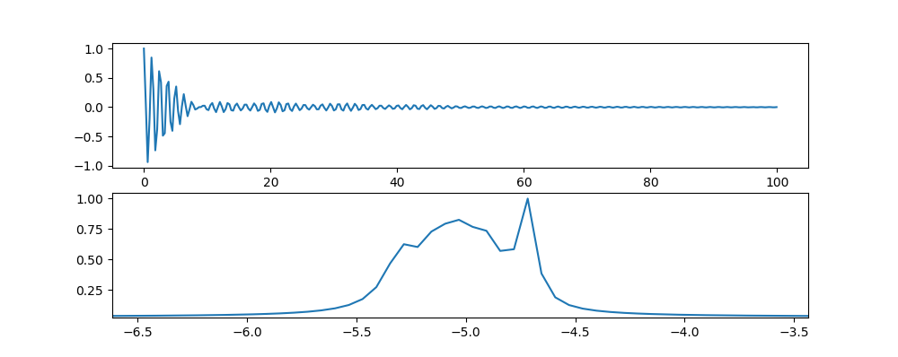
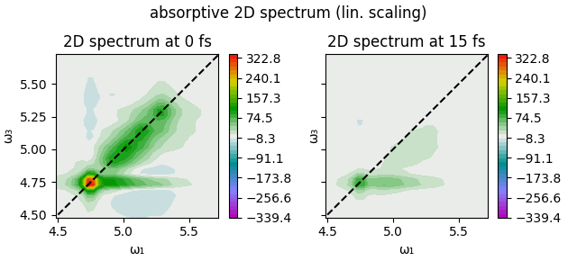

# CMDS.jl

__Simulate coherent multidimensional spectroscopy signals from quantum mechanical models.__

## Introduction

The code relies primarily on [qojulia/QuantumOptics.jl](https://github.com/qojulia/QuantumOptics.jl), which is well described [here](https://docs.qojulia.org/). Further helpful examples and functionalities are found the Python project [QuTiP](http://qutip.org/).

The module [CMDS.jl](/cmds.jl) contains the necessary functions to calculate 2D spectra from QM models and will be described below. [examples/](/examples) shows example scenarios.

## Installation

CMDS requires the Julia language and [qojulia/QuantumOptics.jl](https://github.com/qojulia/QuantumOptics.jl), which can be installed from via the standard sources:

- [Julia](https://docs.julialang.org/en/v1/manual/getting-started/)

- [QoJulia](https://docs.qojulia.org/installation/)

## CMDS.jl - Functions

Type ``?cmds.<function>`` into the REPL to access the documentation for a certain function.

### Available functions:

- __create_colormap__: creates a blue-white-green-red colormap with zero values being white

- __zeropad__: zeropadding of time domain data before Fourier transformation into spectral domain

- __interpt__: interpolate time vector after zeropadding

- __make2Dspectra__: invokes cmds.correlations to calculate different signals

- __correlations__: calculate time evolution and interaction with laser pulses

- __view_dm_evo__: quick way to visualize evolution of density matrix

- __save_2d__: saves 2D plots to 01_Output

- __plot2d__: plots 2D data in out2d

- __crop2d__: crops 2D data to reduce size

- __tri__: select upper or lower triangular matrix, used to simplify pathways

### How to use:

Set up your QM model of interest!

To calculate 2D spectra first initialize the output array

```julia
out2d = Array{cmds.out2d}(undef, length(T))
```

where `` T = [0., 5., 10., ...] `` is a vector containing population/evolution time steps.

Next call `` cmds.make2dspectra() `` in a for loop

```julia
for i = 1:length(T)
    out2d[i] = cmds.make2Dspectra(tlist,rho0,H,F,μ12,μ23,T[i],"lindblad";debug=false,zp=zp)
end
```

with ``tlist`` being the coherence/detection time steps, ``rho0`` the equilibrium/ground state density matrix, ``H`` the system Hamiltonian, ``F`` the jump operator (Lindblad operator) or the Redfield tensor, ``μ12`` the transition dipole operator between the ground and single excited states, and ``μ23`` the transition dipole operator between the single and double excited states. ``T[i]`` is the current population time. The option ``"lindblad"`` or ``"redfield"`` selects which ... to use. ``debug=true`` activates the debugging output and ``zp`` is the zero padding value of 10<sup>zp</sup>.

Using __multithreading__, several population time steps can be evaluated simultaneously:
```julia
Threads.@threads for i = 1:length(T)
    out2d[i] = cmds.make2Dspectra(...)
end
```
Make sure to disable all output plots within ``cmds.make2Dspectra()`` when using __multithreading__, as these might crash the execution.
## Examples

The following [/examples](/examples) are available.

### coupled_dimer.jl

The properties (angles, coupling strength, etc.) of a coupled dimer system are calculated (see [/examples/coupled_dimer.jl](/examples/coupled_dimer.jl) for details) and QuantumOptics.jl is used to calculate the correlation function and linear absorption spectrum. The output provides the dimer geometry, distribution of the transition dipole moment strength, the system energy level scheme, the correlation function and spectrum.


CMDS.jl uses QuantumOptics.jl to calculate the 3rd-order response functions in a four-wave mixing formalism and calculates the expected 2D spectrum.


The 2D spectrum shows the ground state bleach and stimulated emission (green/yellow/red) of the ... transition on the diagonal and the excited state absorption (blue/purple) of the ... transition as the off-diagonal peak.


### coupledDimer.jl with slightly detuned monomers and reduced coupling

...

Evolution during the population time leads to a decrease in signal intensity:


### displaced_harmonic_oscillator_model.jl

Another [textbook example](chem.libretexts.org/Bookshelves/Physical_and_Theoretical_Chemistry_Textbook_Maps/Book%3A_Time_Dependent_Quantum_Mechanics_and_Spectroscopy_(Tokmakoff)/13%3A_Coupling_of_Electronic_and_Nuclear_Motion/13.01%3A_The_Displaced_Harmonic_Oscillator_Model) is the displaced oscillator (DO) model. [Here](examples/displaced_harmonic_oscillator_model.jl), two electronic levels with vibrational sub-levels are coupled and yield the correlation function and spectrum:


Again, using ``CMDS.jl`` we can calculate the expected 2D spectrum at ``T=0`` ...


... and its temporal evolution.


Of course, the latter is still greatly simplified.

### FCF_morse-potential.jl

As an intermezzo, QuantumOptics.jl can also be used to calculate Franck-Condon factors of a transition between Morse potentials:


TODO 2D with Morse potential

### Jaynes-Cummings model

The coupling between a quantized optical field and a two-level system is described by the Jaynes-Cummings Hamiltonian

H = ω<sub>r</sub> a<sup>†</sup> a + ω<sub>a</sub> σ<sub>+</sub> σ<sub>-</sub> + ( a<sup>†</sup> σ<sub>-</sub> + a σ<sub>+</sub> )

or for you to copy:

```julia
H = wc * at * a + wa * sp * sm + g * (at * sm + a * sp)
```

Here, ω<sub>r</sub> is the energy/frequency/... of the cavity mode, a<sup>†</sup>(a) is the  ... and σ<sub>+</sub>(σ<sub>-</sub>)  the ... . The calculated linear absorption spectrum of the system looks pointy:


2D spectrum of the Jaynes-Cummings model at different delays of the population time T.


### Ensemble of two-level systems with disorder

In order to study the effect of disorder on the 2D signal [examples\ensemble_of_TLSs_w_disorder.jl](examples\ensemble_of_TLSs_w_disorder.jl) creates a composite Hamiltonian of ``num_of_TLSs`` two-level systems, whose energies are distributed by the function used to create ``disorder``. For a Gaussian distribution of energies and 5 ``num_of_TLSs = 5`` the energy diagram looks as follows:


and the relevant single excited manifold


This system leads to the following correlation function and absorption spectrum  with the Lindblad-operator ....



... and the system dynamics:


The resulting 2D spectrum is characterized by an elongated diagonal peak, and relaxation to the lowest excited state leads to sub-diagonal crosspeaks.



#### Evolution of density matrix

Using ``cmds.view_dm_evo()`` you can visualize the temporal (T) evolution of the system density matrix.


### Tavis-Cummings

In order to go beyond the Jaynes-Cummings model ...

### Disentangling GSB, SE and ESA contributions

CMDS.jl outputs the full2d spectrum, as well as the GSB (out2d.gsb), SE (out2d.se) and ESA (out2d.esa) components:

<!---->

<p float="center">


</p>

<!---->

<!---->

In addition, also the rephasing (out2d.full2d_r) and non-rephasing (out2d.full2d_nr) parts of the signal are available:

<p float="left">


</p>


### Convolution with laser spectrum


### Does it wiggle ?

So far, coherence during the population time T were eliminated by setting off-diagonal elements of the density matrix to zero, directly after the second interaction with μ. TBC ...
